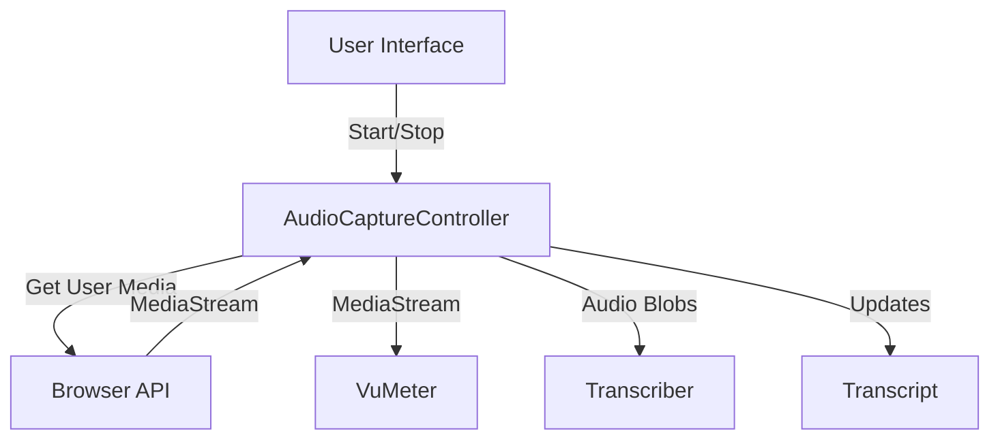

# Design: Audio Capture Controller

## Architecture

The `AudioCaptureController` acts as a bridge between the browser's Media Capture and Streams API and the application's transcription logic.



## Interfaces

### Transcriber Interface
The parallel `Transcriber` development requires a simple contract:
```typescript
interface Transcriber {
    sendAudio(data: Blob): void;
    stop(): void;
}

type TranscriberFactory = () => Transcriber;
```

### AudioCaptureController API
```typescript
class AudioCaptureController {
    // State
    state: 'idle' | 'capturing' | 'muted';
    stream: MediaStream | null;
    
    // Dependencies
    constructor(transcriberFactory: TranscriberFactory, transcript: Transcript);
    
    // Actions
    start(): Promise<void>;
    stop(): void;
    mute(): void;
    unmute(): void;
    setTranscript(transcript: Transcript): void;
}
```

## Considerations

- **Audio Format**: The controller will need to determine the optimal audio format (MIME type) supported by the browser for the `MediaRecorder` or audio processing script.
- **Permissions**: Error handling for microphone permission denial is critical.
- **Reactivity**: Since this is a Vue app, the state and stream should be exposed in a reactive way (likely via a Vue composable `useAudioCapture`).
